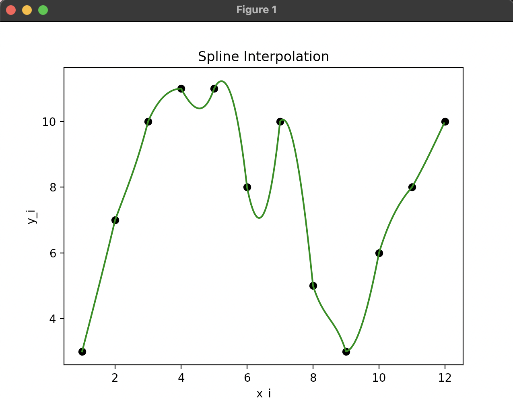
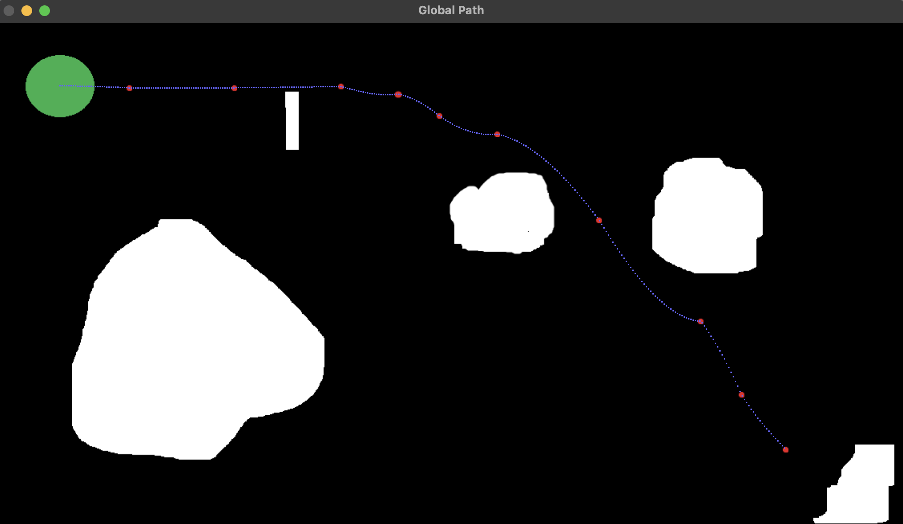
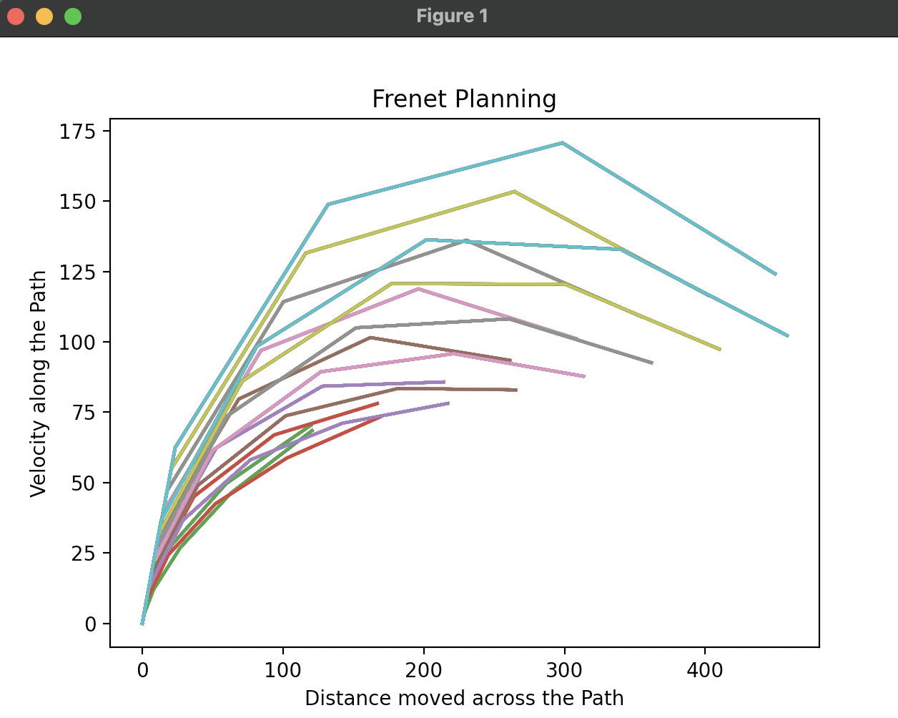
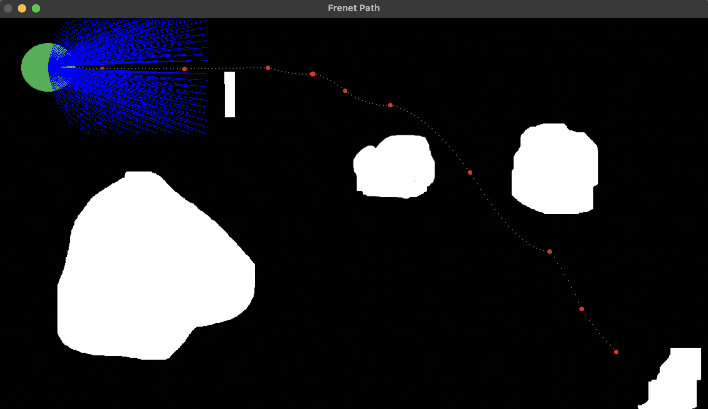
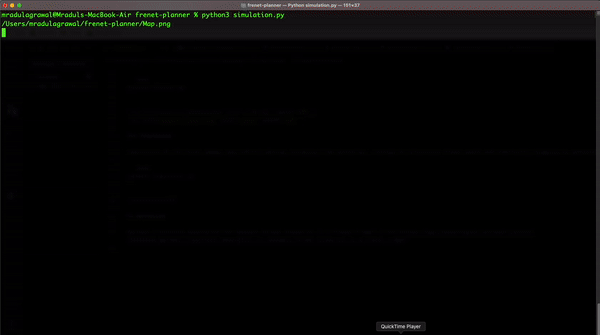
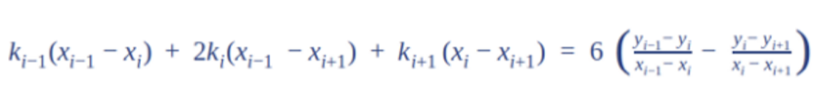
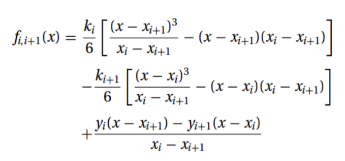

# Frenet Local Path-Planning

Generation of Local Path using Frenet Frame on a Global Path using Spline Interpolation of Waypoints given.

## Requirements

```bash
pip install numpy
pip install opencv-python
```

## Installation

```bash
git clone https://github.com/mradul2/frenet-planner.git
```

## Usage

### Generation of Global Path

Cubic Spline Transformation is used to Generate Waypoints for a Global Path.

```bash
python3 spline.py
```



### Detection using OpenCV

OpenCV functionalities of contour detection are used to find the position of Ego Vehicle and Waypoints which are present on the Target Image.

```bash
python3 detection.py
```



### Generation of a Frenet Path

Using Frenet frame method, here we generate the Frenet trajectories along our global path which we have determined earlier.

```bash
python3 planner.py
```




### Simulation

Simulation on the Given Image: Ego vehicle moving, escaping from obstacles, running on calculated frenet paths and eventually stopping at destination.

```bash
python3 simulation.py
```



## About

### Quintic Polynomial

A 5 degree polynomial class is made for calculating position, velocity, acceleration and jerk for both Longitudinal and Lateral movement. Six coefficients of this polynomial are found using `xstart`, `vstart`, `astart`, `xend`, `vend` and `aend`.

`polynomial.py` contains this Polynomial class and can be used in planning the Frenet Paths. It contains methods such as `derivative_1` and `value` which can be used for calculating instantaneous state parameters.

### Cubic Spline Transformation

> Cubic Spline Interpolation fits a 3 degree polynomial between a given set of cartesian coordinates.

Detected Waypoints are used to apply Cubic Splines between them and in this way Global Path is generated.

#### Natural Cubic Spline

Second derivative of the function at the end points are assumed to be zero

1. Knots or the second derivative are first calculated using Gauss Elimination Method:



2. After having all the n - knots cubic function are designed and the interpolation is used:



`spline.py`contains a functionality `cubicSplineSelf` that interpolates the data between given points and is used in generating Global Path.

### Detection

`detection.py` contains functions to detect the above, you can run this file in terminal to have the
global Path in the given Image.

- `ego` function gives the position and radius of our vehicle at any point of time, It applies contour
detection in a mask that is characterised by the particular green color of the ego. After that
required location and radius is calculated using `cv2.minEnclosingCircle` function.
- `waypoint` function similarly estimates the position of waypoints characterized by their red color
on the given Image.
- `obstacle` function returns a boolean False if the given Frenet Path coordinates are free from
having any obstacle in a circle of radius R around them.

### Frenet Path

`Frenet` class is made in `planner.py` which is a representation of a single Frenet Trajectory, A `Frenet` object stores instantaneous state parameters for both Frenet Frame and Cartesian frame such as `position`, `velocity`, `acceleration` and `jerk`. Along with this each Frenet object is associated with its cost.

`FrenetPath` function determines the collection of `Frenet` objects in Frenet frame when provided with the initial state parameters in Longitudinal and Lateral direction. It returns a list of Frenet objects generated through a Sampling process in the provided `time range`, `Lateral offset`, `Longitudinal velocity offset` and `Longitudinal offset` in the maneuver.

After having a list of all possible Frenet paths, first Cartesian coordinates of all the members present are determined using `frenet2cartesian` function, then that list is passed through `validFrenet` function which filter out those Frenets which are free from any obstacles according to the Radius of ego vehicle, consequently the final optimal Frenet is determined using `bestFrenet` function which returns the Frenet object having minimum Cost Function Value. Finally the `finalFrent` function returns a `Frenet` object for the maneuver.

## Refrences

Optimal Trajectory Generation for Dynamic Street Scenarios in a Frenet Frame: [Link](https://www.researchgate.net/publication/224156269_Optimal_Trajectory_Generation_for_Dynamic_Street_Scenarios_in_a_Frenet_Frame)
